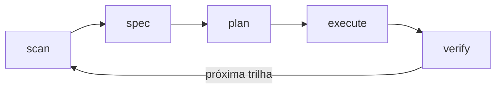
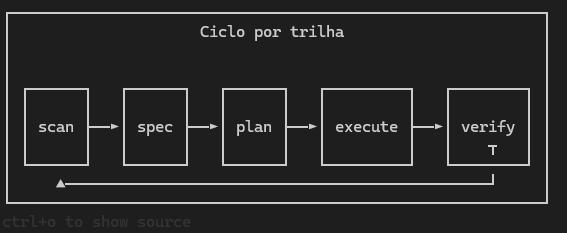

<div align="center">

<p align="center">
  
</p>

**Fluxo spec-driven e context engineering centrado em `.oxe/`** — o núcleo é o mesmo em qualquer ferramenta. O instalador integra com **[Cursor](https://cursor.com)** e **[GitHub Copilot](https://github.com/features/copilot)** por padrão e, com **`--all-agents`** ou escolhas no menu, também com **Claude Code, OpenCode, Gemini CLI, Codex, Windsurf** e **Antigravity**. **Poucos comandos** por runtime, workflows em **`.oxe/workflows/`** (ou **`oxe/workflows/`** com `--global`). Textos do CLI e resumos pós-comando em **português (Brasil)**.

[](https://www.npmjs.com/package/oxe-cc)
[](LICENSE)

**Versão deste repositório / próximo publish npm:** `0.4.0` (fonte: [`package.json`](package.json)). No registo use `npx oxe-cc@latest` ou, para pinar, `npx oxe-cc@0.4.0`.

```bash
npx oxe-cc@latest
# equivalente explícito:
# npx oxe-cc@latest install
```

**Manter atualizado:** no **Cursor** use **`/oxe-update`**; noutras CLIs siga o mesmo fluxo com o terminal no projeto (`npx oxe-cc update --check`, `npx oxe-cc update` ou `npx oxe-cc@latest --force`). Com **`--force`**, alterações locais em arquivos rastreados geram backup em **`~/.oxe-cc/oxe-local-patches/`**.

[Para quem é](#para-quem-é) · [Começar](#começar) · [Como funciona](#como-funciona) · [Novidades v0.4.0](#novidades-v040) · [Modo rápido](#modo-rápido) · [Porque funciona](#porque-funciona) · [Comandos](#comandos) · [CLI (`oxe-cc`)](#cli-do-pacote-oxe-cc) · [Configuração](#configuração) · [SDK](#sdk-api-programática) · [Problemas](#resolução-de-problemas)

</div>

---

## Para quem é

Para quem quer **descrever o que quer e ver isso construído de forma consistente** — **sem** simular uma organização enorme de processos em cima do repositório.

OXE é **enxuto**: não há dezenas de comandos por ferramenta. Há **um CLI** que deixa o repositório **só com `.oxe/`** (layout **padrão**) ou **`oxe/` + `.oxe/`** com **`--global`**, e copia integrações para os homes que escolheres — tipicamente **`~/.cursor`**, **`~/.copilot`** e **`~/.claude`**, ou **OpenCode, Gemini, Codex, Windsurf, Antigravity** quando ativas — sempre com **workflows em Markdown** e **estado em disco** para a sessão não ficar **sobrecarregada** com tudo o que já foi decidido.

---

## Começar

**Requisito:** [Node.js 18+](https://nodejs.org/).

Na **raiz do repositório** do seu projeto:

```bash
npx oxe-cc@latest
```

Em **terminal interativo**, o instalador pergunta em **vários passos**: (1) **para quais ambientes** (Cursor, Copilot, OpenCode, Gemini, … ou todos); (2) **global vs local** no disco; (3) **layout no repositório** — **clássico** (`oxe/` na raiz + `.oxe/`) ou **mínimo** (**só `.oxe/`**). Em modo **global IDE**, as integrações vão para pastas do **usuário** (`~/.cursor`, `~/.copilot`, …); com **`--ide-local`**, podem ficar no repo (`.cursor`, `.github`, …). Por omissão antiga, **não** se criam pastas IDE dentro do repo. Com layout clássico e **`--vscode`**, **`.vscode/`** fica no projeto.

Ao terminar, o CLI mostra um **resumo do que foi criado ou atualizado** e **próximos passos sugeridos** (por exemplo `npx oxe-cc doctor`, `/oxe-scan`).

Sem TTY (CI), o **layout mínimo** (só `.oxe/`) e integrações no **HOME** são o padrão (Cursor + Copilot; sem **`--all-agents`** a menos que configures). Use **`--global`** para também ter **`oxe/`** na raiz. Flags: **`--cursor`**, **`--copilot`**, **`--all-agents`**, **`--all`**, **`--oxe-only`**, **`OXE_NO_PROMPT=1`**, etc.

Se já existir **`.oxe/config.json`** com o bloco **`install`** (perfil, `repo_layout`, …), o `oxe-cc` aplica isso **quando não passas** flags explícitas de integração — útil em CI. Para ignorar o ficheiro nessa corrida: **`--no-install-config`**. Detalhes: [`oxe/templates/CONFIG.md`](oxe/templates/CONFIG.md).

No fim, em modo interativo, pergunta se você quer instalar o **`oxe-cc` globalmente** (`npm install -g`) ou continuar só com **`npx`**. Em CI ou scripts use **`--no-global-cli`** / **`-l`**, ou defina **`OXE_NO_PROMPT=1`**. Para instalar o CLI sem pergunta: **`--global-cli`** / **`-g`**.

**GitHub Copilot CLI:** o CLI **não** trata `~/.copilot/commands/` como slash commands (isso é legado estilo Claude/Cursor). Com **`--copilot-cli`**, o OXE instala **agent skills** em **`~/.copilot/skills/`** (ex.: `oxe-scan/SKILL.md`, `oxe/SKILL.md`), invocáveis como **`/oxe-scan`**, **`/oxe`** (entrada = mesmo fluxo que `/oxe-help`), etc. Depois de instalar ou atualizar, use **`/skills reload`** ou reinicie o `copilot`. Mantém-se também cópia para **`~/.claude/commands/`** e **`~/.copilot/commands/`** para ferramentas que ainda leiam essa pasta. Se usar **`COPILOT_HOME`**, o `oxe-cc` grava skills nesse diretório (alinhado ao CLI oficial).

**Multi-agente (`--all-agents`):** instalação **paralela** nos homes canónicos de cada ferramenta — **Cursor** e **Copilot** (como no padrão), **Claude Code** (`~/.claude/commands`), **OpenCode** (`$XDG_CONFIG_HOME/opencode/commands` e `~/.opencode/commands`), **Gemini CLI** (`~/.gemini/commands`: `/oxe`, `/oxe:scan` — depois **`/commands reload`**), **Codex** (`~/.agents/skills` + prompts em **`~/.codex/prompts`** como `/prompts:oxe-*`), **Windsurf** (`~/.codeium/windsurf/global_workflows`, workflows `/oxe-scan`), **Antigravity** (`~/.gemini/antigravity/skills`). No menu interativo, opção **6**. O núcleo do fluxo continua em **`.oxe/`** (SPEC/PLAN/VERIFY e artefactos opcionais). O passo **research** (`research.md`, `.oxe/research/`, `RESEARCH.md`) é **opcional** e não faz parte da trilha mínima scan → spec → plan → execute → verify.

**Confirmar instalação no agente**

| Onde | O que executar |
|------|----------------|
| **Cursor** | `/oxe-help` ou outro `/oxe-*` |
| **Copilot** (VS Code) | `/oxe-help` no chat, se [prompt files](https://code.visualstudio.com/docs/copilot/customization/prompt-files) estiverem ativos (`"chat.promptFiles": true` — exemplo em [`.vscode/settings.json`](.vscode/settings.json)) |
| **Copilot CLI** | `/oxe` ou `/oxe-scan` após **`/skills reload`** |
| **Gemini CLI** | `/oxe` ou `/oxe:scan` após **`/commands reload`** (se instalou essa stack) |
| **OpenCode / Codex / Windsurf / Antigravity** | Ver caminhos no resumo pós-instalação e o README na secção **Multi-agente** |

> **Nota:** Instruções e prompt files do Copilot (VS Code) ficam em **`~/.copilot/`** por padrão, não em `.github/` no repo alvo. **`oxe-cc doctor`** aceita workflows em **`.oxe/workflows/`** ou **`oxe/workflows/`**. Em qualquer IDE, você ainda pode pedir em linguagem natural com o repositório e o workflow em contexto.

**Sem pacote no npm** (`npm view oxe-cc version` → 404): clone este repo, `npm link` na pasta **oxe-build**, `npm link oxe-cc` no seu projeto e execute `oxe-cc`. Alternativa: `node /caminho/oxe-build/bin/oxe-cc.js`.

<details>
<summary><strong>Instalação: flags úteis (CI, ou só parte do pacote)</strong></summary>

| Flag | Efeito |
|------|--------|
| `--force` / `-f` | Sobrescreve arquivos já existentes (**obrigatório** para atualizar cópias antigas) |
| `--dry-run` | Lista ações sem escrever |
| `--cursor` / `--copilot` | Instala só uma das stacks |
| `--oxe-only` | Só workflows + templates dentro de **`.oxe/`** (sem integrações IDE) |
| `--no-init-oxe` | Não executa o bootstrap de `STATE.md` / `config.json` / `codebase/` (mantém `.oxe/workflows` se copiados) |
| `--global` | Layout **clássico**: **`oxe/`** na raiz do repo + **`.oxe/`**; IDE em `~/.cursor`, `~/.copilot`, `~/.claude` |
| `--local` | Layout **mínimo** (padrão): **só `.oxe/`** com **`.oxe/workflows/`**; IDE nas mesmas pastas do usuário |
| `--global-cli` / `-g` | Após copiar: `npm install -g oxe-cc@versão` (sem pergunta) |
| `--no-global-cli` / `-l` | Não pergunta nem instala o CLI global (útil em CI) |
| `--copilot-cli` | **Skills** em **`~/.copilot/skills/`** (`/oxe`, `/oxe-scan`, …) + cópia legado em **`~/.claude/commands/`** e **`~/.copilot/commands/`** |
| `--all-agents` | Tudo de `--copilot-cli` **mais** OpenCode, Gemini (TOML), Codex, Windsurf, Antigravity (ver texto acima) |
| `--all` / `-a` | Cursor + Copilot (padrão quando não indicas `--cursor` nem `--copilot`) |
| `--vscode` | Copia `.vscode/settings.json` (só com layout **`--global`**) |
| `--no-commands` | Omite `commands/oxe/` |
| `--no-agents` | Omite `AGENTS.md` |
| `--no-install-config` | Ignora o bloco `install` em `.oxe/config.json` nesta instalação |
| `--config-dir` / `-c` | Pasta base para **uma** integração (`--cursor`, `--copilot` ou `--copilot-cli`); não combina com `--all-agents` |
| `--dir <pasta>` ou argumento posicional | Destino em vez do diretório atual |

**Global:** `npm install -g oxe-cc`.

**Subcomandos**

| Comando | Função |
|---------|--------|
| `oxe-cc` ou `oxe-cc install` | Instalação predefinida (mesmo comportamento; `install` é alias explícito) |
| `oxe-cc doctor` | Valida Node, workflows do pacote, `.oxe/`, coerência STATE vs arquivos, scan/compact antigos (`scan_max_age_days`, `compact_max_age_days`), seções da SPEC, ondas do PLAN |
| `oxe-cc status` | Leve: coerência `.oxe/` + **um** próximo passo sugerido (espelha o workflow `next`; não exige o conjunto completo de workflows como o `doctor`). **`--json`**: uma linha JSON com `nextStep`, `diagnostics`, `staleCompact`, etc. **`--hints`**: lembretes de rotina (scan/compact por idade). |
| `oxe-cc init-oxe` | Só o bootstrap `.oxe/` (STATE, config, codebase) |
| `oxe-cc uninstall` | Remove integrações OXE em `~/.cursor`, `~/.copilot`, `~/.claude` e pastas de workflows no repo (`--ide-only` só no HOME) |
| `oxe-cc update` | Executa `npx oxe-cc@latest --force` na pasta do projeto; **`--check`** só consulta o npm; **`--if-newer`** evita o npx quando já está na última |

</details>

<details>
<summary><strong>Desenvolvimento (clonar o oxe-build)</strong></summary>

```bash
git clone https://github.com/propagno/oxe-build.git
cd oxe-build
npm test
node bin/oxe-cc.js --help
```

Para testar no seu app: `npm link` aqui, depois `npm link oxe-cc` no projeto alvo.

</details>

---

## Como funciona

### Ciclo por trilha

Fluxo sugerido (cada iteração de trabalho segue a trilha e volta ao **scan** quando for hora de realinhar com o repo):



**verify (T):** as tarefas **T** do plano trazem o bloco **Verificar** (comando ou checklist) por item; o passo **`/oxe-verify`** cruza SPEC + PLAN com o código e grava **`.oxe/VERIFY.md`**.

<p align="center"></p>

**Já tem código no repositório?** Comece por **`/oxe-scan`**. Isso gera mapas em **`.oxe/codebase/`** (stack, estrutura, testes, convenções, etc.). Assim o **spec** e o **plan** alinham com o repo real antes de planear em grande escala.

### 1. Mapear — `/oxe-scan`

Inventaria o projeto e preenche **`.oxe/codebase/*.md`**, atualiza **`.oxe/STATE.md`**. Você pode indicar foco opcional (ex.: “só API”).

### 2. Especificar — `/oxe-spec`

Produz ou atualiza **`.oxe/SPEC.md`**: objetivo, escopo, critérios de aceite, riscos. Isso é o contrato antes do plano.

### 3. Discutir *(opcional)* — `/oxe-discuss`

Captura decisões de implementação (UI, API, tom, edge cases) em **`.oxe/DISCUSS.md`**, para o plano não “adivinhar” o que você prefere. Útil quando `discuss_before_plan` está ativo em `.oxe/config.json`. **Pular** este passo = defaults razoáveis; **usar** = mais próximo da sua visão.

### 4. Planear — `/oxe-plan`

Gera **`.oxe/PLAN.md`**: tarefas **atômicas**, **ondas** (paralelo vs sequencial), e bloco **Verificar** (comando de teste ou checklist) **por tarefa**. Ideia: cada tarefa cabe num contexto de agente focado, com verificação explícita — em Markdown, sem XML obrigatório.

Ondas em resumo: tarefas **independentes** na mesma onda podem **rodar** em paralelo; **dependentes** vão para ondas posteriores (organização por ondas, com pouca cerimônia).

**Variante plan-agent:** **`/oxe-plan-agent`** gera o mesmo **`.oxe/PLAN.md`** (com **Verificar** e **Aceite** por tarefa) **e** **`.oxe/plan-agents.json`** (schema **2**: `runId`, `lifecycle`): papéis (`role`), âmbito (`scope`), `inputs`/`outputs` sugeridos, dependências entre **agentes** e **`execution.waves`**. Handoffs entre agentes seguem **`oxe/workflows/references/plan-agent-chat-protocol.md`** (ficheiros em **`.oxe/plan-agent-messages/`**). Os papéis do blueprint são **exclusivos** da trilha **execute** desse plano (alinhados ao `runId` no **STATE**); **`/oxe-quick`** **invalida** o blueprint; trabalho fora das tarefas do **PLAN** não deve reutilizar essas personas.

### 5. Executar — implementação + `/oxe-execute` *(opcional)*

Implemente no editor ou deixe o agente seguir **`/oxe-execute`** sobre o plano (ou QUICK). O OXE não impõe subagentes nem commits atômicos por tarefa; isso fica a cargo do **seu** fluxo com Git.

### 6. Verificar — `/oxe-verify`

Cruza **SPEC** + **PLAN** com o código; escreve **`.oxe/VERIFY.md`**. Se algo falhar, corrija ou replaneje (`/oxe-plan` com lógica de replanejamento descrita no workflow).

### 7. Seguir em frente — `/oxe-next` e ciclo

Para a **próxima** feature ou fase: de novo **spec → plan → …** ou **`/oxe-next`** para sugerir o passo lógico a partir de **STATE.md**.

---

## Novidades v0.4.0

### Fidelidade de Decisões (IDs D-NN)

`/oxe-discuss` agora fecha cada decisão com um **ID estável** (`D-01`, `D-02`, …) registado numa tabela em `.oxe/DISCUSS.md`. O PLAN.md referencia esses IDs no campo **Decisão vinculada:** de cada tarefa; o `/oxe-verify` valida na **Camada 3** se todas as decisões fechadas foram cobertas por alguma tarefa. Isso fecha o ciclo discuss → plan → verify sem derivar do que foi acordado.

### Verificação em 4 Camadas

`/oxe-verify` passou de 1-2 checagens para **4 camadas progressivas**:

| Camada | Nome | O que faz |
|--------|------|-----------|
| 1 | Auditoria pré-execução | Valida integridade do PLAN antes de executar qualquer tarefa |
| 2 | Tarefas + critérios | Cruza cada Tn com critérios A* da SPEC |
| 3 | Fidelidade de decisões | Verifica se cada D-NN foi implementado conforme decidido |
| 4 | UAT | Gera checklist de aceitação para o utilizador validar manualmente |

### Profiles de Execução

`.oxe/config.json` agora aceita `"profile": "strict" | "balanced" | "fast" | "legacy"`. Um profile expande em múltiplas config keys — não é preciso configurar cada uma manualmente. `strict` ativa verificação mais profunda e UAT; `fast` reduz cerimônia para projetos pequenos; `legacy` adapta o fluxo para sistemas com restrições. Use `scale_adaptive: true` para que o `/oxe-scan` sugira automaticamente o profile com base no tamanho do projeto.

### Personas de Agentes

Diretório `oxe/personas/` (copiado para `.oxe/personas/` no install) com **8 personas especializadas**: `executor`, `planner`, `verifier`, `researcher`, `debugger`, `architect`, `ui-specialist`, `db-specialist`. Cada persona define comportamento, ferramentas preferidas e restrições. Use o campo `persona` nos agentes do `plan-agents.json` para especializar o executor.

### Milestones e Workstreams

- **`/oxe-milestone`** — marcos de entrega com IDs `M-NN`. Subcomandos: `new`, `complete`, `status`, `audit`. O `complete` arquiva SPEC/PLAN/VERIFY/DISCUSS em `.oxe/milestones/M-NN/`.
- **`/oxe-workstream`** — tracks de desenvolvimento paralelos em `.oxe/workstreams/<nome>/`. Cada workstream tem seus próprios SPEC, PLAN, VERIFY e STATE independentes. Subcomandos: `list`, `new`, `switch`, `status`, `close`.

### Plugin System

Hooks de lifecycle em **`.oxe/plugins/*.cjs`** com **18 eventos**: `onBeforeScan`, `onAfterScan`, `onBeforePlan`, `onAfterPlan`, `onBeforeVerify`, `onVerifyComplete`, `onMilestoneNew`, `onMilestoneComplete`, e mais. Referência: [`oxe/templates/PLUGINS.md`](oxe/templates/PLUGINS.md). Configuração: chave `plugins` em `.oxe/config.json`.

### SDK Expandido

```js
const oxe = require('oxe-cc');

// Parsear artefatos OXE
const plan = oxe.parsePlan(fs.readFileSync('.oxe/PLAN.md', 'utf8'));
const spec = oxe.parseSpec(fs.readFileSync('.oxe/SPEC.md', 'utf8'));
const state = oxe.parseState(fs.readFileSync('.oxe/STATE.md', 'utf8'));

// Validar fidelidade de decisões
const fidelity = oxe.validateDecisionFidelity(discussMd, planMd);
// fidelity.ok, fidelity.gaps, fidelity.covered

// Segurança: paths e secrets
const safe = oxe.security.checkPathSafety(filePath, projectRoot);
const secrets = oxe.security.scanFileForSecrets(filePath);

// Plugins
const { plugins } = oxe.plugins.loadPlugins(projectRoot);
await oxe.plugins.runHook(plugins, 'onBeforeScan', { target: projectRoot });

// Doctor com segurança
const result = oxe.runDoctorChecks({ projectRoot, includeSecurity: true });
// result.securityReport.secretFiles, result.securityReport.pluginsValid
```

---

## Modo rápido

Para trabalho **ad hoc** sem roadmap completo:

**`/oxe-quick`** gera **`.oxe/QUICK.md`** com passos curtos e verificação. **Perfil fast:** objetivo numa frase, no máximo **10** passos — ver `oxe/workflows/quick.md`. Depois você pode usar **`/oxe-execute`** em cima disso ou implementar direto e fechar com **`/oxe-verify`**. Se existir um blueprint **`plan-agents.json`** (schema 2) ainda activo, o quick **invalida** esse blueprint (não reutiliza os agentes definidos para o plano).

Se o trabalho crescer, **promova** para spec + plan completos (mesmos gatilhos: muitos ficheiros, API pública, segurança, etc.).

---

## Porque funciona

**Context engineering:** o agente não precisa de “lembrar” tudo na janela principal — o que importa está em arquivos **pequenos e por etapa**.

| Artefato | Função |
|----------|--------|
| `.oxe/STATE.md` | Fase, decisões (D-NN), milestone/workstream ativos — memória entre sessões |
| `.oxe/codebase/*.md` | Mapa do repo após scan |
| `.oxe/SPEC.md` | O que entregar e como saber que está certo |
| `.oxe/DISCUSS.md` | Decisões com IDs estáveis D-01, D-02, … *(opcional)* |
| `.oxe/PLAN.md` | Tarefas atômicas + **Verificar** por item + **Decisão vinculada:** D-NN |
| `.oxe/plan-agents.json` | Blueprint opcional (agentes + personas + ondas) após **`/oxe-plan-agent`** |
| `.oxe/QUICK.md` | Modo rápido |
| `.oxe/NOTES.md` | Fila leve antes de discuss/plan *(opcional)* |
| `.oxe/FORENSICS.md` / `.oxe/DEBUG.md` | Recuperação e debug *(opcional)* |
| `.oxe/UI-SPEC.md` / `.oxe/UI-REVIEW.md` | Contrato e revisão UI *(opcional)* |
| `.oxe/VERIFY.md` | Resultado das verificações (4 camadas) |
| `.oxe/SUMMARY.md` | Resumo para replanejamento *(opcional)* |
| `.oxe/MILESTONES.md` + `.oxe/milestones/M-NN/` | Marcos de entrega com arquivo *(opcional)* |
| `.oxe/workstreams/<nome>/` | Tracks paralelos de desenvolvimento *(opcional)* |
| `.oxe/personas/` | Definições comportamentais dos agentes *(opcional)* |
| `.oxe/plugins/*.cjs` | Hooks de lifecycle *(opcional)* |
| `.oxe/memory/` | Memory sidecars por sessão/agente *(opcional)* |
| `oxe/workflows/*.md` ou `.oxe/workflows/*.md` | **Fonte única** dos passos no **projeto** após instalar (no **pacote** npm, os modelos vivem em `oxe/workflows/`) |

**Formato:** planos em Markdown com seções fixas (incl. verificação), legíveis por humanos e por modelos — sem XML obrigatório, mas com a mesma ideia de *precise instructions + verify*.

---

## Comandos

Slash commands (Cursor: `~/.cursor/commands/` após instalar) e prompt files (Copilot: `~/.copilot/prompts/` com `chat.promptFiles`). A **fonte única** dos passos está em [`oxe/workflows/*.md`](oxe/workflows/) no pacote ou em [`.oxe/workflows/`](.oxe/workflows/) no projeto após `npx oxe-cc`.

### Resumo rápido

| Comando / prompt | Workflow (fonte dos passos) |
|------------------|-------------------|
| `/oxe-scan` | [`scan.md`](oxe/workflows/scan.md) |
| `/oxe-spec` | [`spec.md`](oxe/workflows/spec.md) |
| `/oxe-discuss` | [`discuss.md`](oxe/workflows/discuss.md) |
| `/oxe-plan` | [`plan.md`](oxe/workflows/plan.md) |
| `/oxe-plan-agent` | [`plan-agent.md`](oxe/workflows/plan-agent.md) |
| `/oxe-quick` | [`quick.md`](oxe/workflows/quick.md) |
| `/oxe-execute` | [`execute.md`](oxe/workflows/execute.md) |
| `/oxe-verify` | [`verify.md`](oxe/workflows/verify.md) |
| `/oxe-next` | [`next.md`](oxe/workflows/next.md) |
| `/oxe-help` | [`help.md`](oxe/workflows/help.md) |
| `/oxe-update` | [`update.md`](oxe/workflows/update.md) |
| `/oxe-forensics` | [`forensics.md`](oxe/workflows/forensics.md) |
| `/oxe-debug` | [`debug.md`](oxe/workflows/debug.md) |
| `/oxe-route` | [`route.md`](oxe/workflows/route.md) |
| `/oxe-research` | [`research.md`](oxe/workflows/research.md) |
| `/oxe-validate-gaps` | [`validate-gaps.md`](oxe/workflows/validate-gaps.md) |
| `/oxe-compact` | [`compact.md`](oxe/workflows/compact.md) |
| `/oxe-checkpoint` | [`checkpoint.md`](oxe/workflows/checkpoint.md) |
| `/oxe-milestone` | [`milestone.md`](oxe/workflows/milestone.md) |
| `/oxe-workstream` | [`workstream.md`](oxe/workflows/workstream.md) |
| `/oxe-ui-spec` | [`ui-spec.md`](oxe/workflows/ui-spec.md) |
| `/oxe-ui-review` | [`ui-review.md`](oxe/workflows/ui-review.md) |
| `/oxe-review-pr` *(prompt Copilot; ver nota abaixo)* | [`review-pr.md`](oxe/workflows/review-pr.md) |
| *(mantenedores)* `workflow-authoring` em linguagem natural | [`workflow-authoring.md`](oxe/workflows/workflow-authoring.md) |

### Referência completa por passo

#### `/oxe-scan`

- **O que faz:** Analisa o repositório e produz **sete** mapas estruturados em `.oxe/codebase/` (overview, stack, estrutura, testes, integrações, convenções, preocupações) e atualiza `.oxe/STATE.md` com data de scan e fase sugerida. Com `scale_adaptive: true` na config, detecta automaticamente o tamanho do projeto e **sugere um profile** (`fast` < 50 ficheiros; `balanced` 50-500; `strict` > 500).
- **Artefatos:** `.oxe/codebase/*.md`, `.oxe/STATE.md` (não apaga `SPEC.md` / `PLAN.md`).
- **Quando usar:** Após clonar, quando o repo mudou muito, ou quando quiser foco opcional (pasta/módulo) ou `scan_focus_globs` em `.oxe/config.json`.
- **Limite:** Não executa testes por si; não substitui leitura do código — condensa para contexto de agente. Repositórios legado: segue também [`references/legacy-brownfield.md`](oxe/workflows/references/legacy-brownfield.md).
- **Workflow:** [`oxe/workflows/scan.md`](oxe/workflows/scan.md)

#### `/oxe-spec`

- **O que faz:** Regista o contrato do trabalho em `.oxe/SPEC.md`: objetivo, escopo, **critérios de aceite com IDs estáveis (A1, A2, …)** e coluna *Como verificar*, suposições e riscos.
- **Artefatos:** `.oxe/SPEC.md`, `.oxe/STATE.md` (fase `spec_ready`).
- **Quando usar:** Antes de planear qualquer entrega média ou grande; entrada pode ser texto livre ou `@ficheiro.md`.
- **Limite:** Não implementa código; o plano e o verify é que amarram tarefas aos **A*** .
- **Workflow:** [`oxe/workflows/spec.md`](oxe/workflows/spec.md)

#### `/oxe-research`

- **O que faz:** Cria uma **nota datada** em `.oxe/research/YYYY-MM-DD-<slug>.md` e atualiza **`.oxe/RESEARCH.md`** (índice/histórico); spikes, mapa de sistema, engenharia reversa, hipóteses de modernização ou qualquer exploração com evidência antes do plano.
- **Artefatos:** `.oxe/research/*.md`, `.oxe/RESEARCH.md`, `.oxe/STATE.md` se útil.
- **Quando usar:** Incerteza técnica ou de âmbito; sistemas grandes por progressive disclosure (várias sessões); opcional após **spec** e antes de **plan**.
- **Limite:** Não substitui SPEC/PLAN; não sobrescreve notas antigas sem pedido explícito.
- **Workflow:** [`oxe/workflows/research.md`](oxe/workflows/research.md)

#### `/oxe-discuss`

- **O que faz:** Regista perguntas, respostas e decisões em `.oxe/DISCUSS.md` (máx. 7 perguntas enxutas) antes do plano, alinhado à SPEC. Cada decisão fechada recebe um **ID estável (`D-01`, `D-02`, …)** registado numa tabela com colunas ID / Decisão / Data / Impacto.
- **Artefatos:** `.oxe/DISCUSS.md` (tabela D-NN), `.oxe/STATE.md` (`discuss_complete`, decisões D-NN).
- **Quando usar:** Ambiguidade na SPEC, risco técnico, ou `discuss_before_plan: true` em `.oxe/config.json`.
- **Limite:** Opcional; não substitui a SPEC nem o PLAN. Sem `/oxe-discuss`, o plano usa defaults razoáveis.
- **Workflow:** [`oxe/workflows/discuss.md`](oxe/workflows/discuss.md) · template: [`oxe/templates/DISCUSS.template.md`](oxe/templates/DISCUSS.template.md)

#### `/oxe-plan`

- **O que faz:** Gera ou atualiza `.oxe/PLAN.md` com tarefas **Tn**, **ondas**, dependências, bloco **Verificar** por tarefa, **Aceite vinculado** aos critérios **A*** da SPEC e campo **Decisão vinculada: D-NN** quando existe `/oxe-discuss` com IDs; suporta `--replan` após `verify_failed` usando `VERIFY.md` / `SUMMARY.md`.
- **Artefatos:** `.oxe/PLAN.md`, `.oxe/STATE.md` (`plan_ready`).
- **Quando usar:** SPEC pronta (e discuss, se a config obrigar); base em `.oxe/codebase/*` e código real.
- **Limite:** Não executa as tarefas — isso é **execute** + o teu Git.
- **Workflow:** [`oxe/workflows/plan.md`](oxe/workflows/plan.md)

#### `/oxe-plan-agent`

- **O que faz:** Igual ao plano OXE em **tarefas verificáveis** (`PLAN.md`), mais **`.oxe/plan-agents.json`** (schema **2**: `runId`, `lifecycle`): define **agentes** (papel, âmbito, `taskIds`, dependências, entradas/saídas sugeridas) e **`execution.waves`**. Cria **`.oxe/plan-agent-messages/`** (README + mensagens conforme [`references/plan-agent-chat-protocol.md`](oxe/workflows/references/plan-agent-chat-protocol.md)). Inclui gate de coerência entre JSON e `Tn`.
- **Artefatos:** `.oxe/PLAN.md`, `.oxe/plan-agents.json`, `.oxe/plan-agent-messages/`, `.oxe/STATE.md` (`plan_ready` + secção blueprint).
- **Quando usar:** Equipas que querem **roteiro explícito por “subagente”**, handoffs escritos entre ondas, ou ondas paralelas por domínio sem perder **Verificar** por tarefa.
- **Limite:** Papéis do blueprint são **só** para **`/oxe-execute`** alinhado ao `PLAN.md` e `runId`; **`/oxe-quick`** invalida o blueprint; pedidos fora do plano não devem reutilizar essas personas.
- **Workflow:** [`oxe/workflows/plan-agent.md`](oxe/workflows/plan-agent.md) · modelo JSON: [`oxe/templates/plan-agents.template.json`](oxe/templates/plan-agents.template.json) · schema: [`oxe/schemas/plan-agents.schema.json`](oxe/schemas/plan-agents.schema.json)

#### `/oxe-ui-spec`

- **O que faz:** Gera ou atualiza **`.oxe/UI-SPEC.md`**: contrato de UI/UX derivado da **SPEC** (âmbito, estados, acessibilidade, breakpoints, tokens quando aplicável).
- **Artefatos:** `.oxe/UI-SPEC.md`, `.oxe/STATE.md` (nota de fase / próximo passo conforme o workflow).
- **Quando usar:** Depois de **spec** e **antes** (ou em paralelo cognitivo) do **plan**, para entregas com interface; o **plan** pode referenciar secções do UI-SPEC nas tarefas de front.
- **Limite:** Só faz sentido se houver UI; projetos só API/backend podem ignorar este passo. Não substitui a SPEC.
- **Workflow:** [`oxe/workflows/ui-spec.md`](oxe/workflows/ui-spec.md)

#### `/oxe-quick`

- **O que faz:** Fluxo curto com `.oxe/QUICK.md` (passos numerados + verificar) para trabalho pontual sem SPEC/PLAN longos.
- **Artefatos:** `.oxe/QUICK.md`, `.oxe/STATE.md` conforme fluxo.
- **Quando usar:** Fix ou spike muito pequeno; promover a spec/plan se o trabalho crescer.
- **Limite:** Menos trilha de auditoria que SPEC+PLAN completos.
- **Workflow:** [`oxe/workflows/quick.md`](oxe/workflows/quick.md)

#### `/oxe-execute`

- **O que faz:** Guia a implementação **onda a onda** com base em `PLAN.md` (ou passos de `QUICK.md`), com checklist explícito e atualização de `.oxe/STATE.md` (progresso Tn / ondas). Com blueprint **válido** (`lifecycle` + `runId` alinhado ao STATE), aplica papéis do JSON só às tarefas do plano e regista handoffs em **`.oxe/plan-agent-messages/`** quando agentes dependem uns dos outros.
- **Artefatos:** Código/docs que implementas; `.oxe/STATE.md` (checklist de onda).
- **Quando usar:** Durante a execução do plano ou do QUICK, para não saltar pré-requisitos nem verificações da onda.
- **Limite:** Não faz commits nem impõe subagentes — fica a teu critério de equipa.
- **Workflow:** [`oxe/workflows/execute.md`](oxe/workflows/execute.md)

#### `/oxe-ui-review`

- **O que faz:** Produz **`.oxe/UI-REVIEW.md`**: auditoria da implementação face ao **UI-SPEC** (checklist, bloqueios P0/P1, sugestões), tipicamente após trabalho de front e **antes** ou como entrada para o **verify** global.
- **Artefatos:** `.oxe/UI-REVIEW.md`, `.oxe/STATE.md` se útil.
- **Quando usar:** Depois de implementar ecrãs/componentes cobertos pelo UI-SPEC; se não existir `UI-SPEC.md`, o workflow pede **ui-spec** primeiro ou regista revisão *ad hoc* (menos ideal).
- **Limite:** Não substitui **`/oxe-verify`** — o verify continua a cruzar SPEC, PLAN, evidência técnica e, quando existir, UI-REVIEW.
- **Workflow:** [`oxe/workflows/ui-review.md`](oxe/workflows/ui-review.md)

#### `/oxe-verify`

- **O que faz:** Verificação em **4 camadas progressivas**: (1) auditoria pré-execução do PLAN — integridade, D-NN, tarefas Tn válidas; (2) confronto de **cada** critério **A*** da SPEC com evidência; (3) fidelidade de decisões — verifica se cada D-NN foi implementado conforme decidido; (4) UAT — gera checklist de aceitação para validação manual. Regista tudo em `.oxe/VERIFY.md`; opcionalmente rascunho de commit e checklist de PR conforme `.oxe/config.json`.
- **Artefatos:** `.oxe/VERIFY.md` (tabelas de auditoria, tarefas, critérios, D-NN, UAT), `.oxe/STATE.md` (`verify_complete` / `verify_failed`), `.oxe/SUMMARY.md` quando há gaps relevantes.
- **Quando usar:** Após implementar uma onda ou fechar o plano; pode focar uma tarefa **Tn** se indicares.
- **Limite:** Sandbox pode impedir comandos — regista “não executado aqui” e deixa o comando para correres localmente. A Camada 3 só tem efeito se existir DISCUSS.md com D-NN; a Camada 4 exige `after_verify_suggest_uat: true` na config.
- **Workflow:** [`oxe/workflows/verify.md`](oxe/workflows/verify.md)

#### `/oxe-validate-gaps`

- **O que faz:** Auditoria **complementar** pós-verify: cruza PLAN + VERIFY (+ SPEC), lista gaps de cobertura/evidência em **`.oxe/VALIDATION-GAPS.md`** e sugere tarefas em texto (Nyquist-lite).
- **Artefatos:** `.oxe/VALIDATION-GAPS.md`, opcionalmente `STATE.md`.
- **Quando usar:** Depois de **`/oxe-verify`** (passou ou falhou), para fechar dívida de testes ou evidência fraca.
- **Limite:** Não altera `PLAN.md` por defeito nem substitui um novo verify após correções.
- **Workflow:** [`oxe/workflows/validate-gaps.md`](oxe/workflows/validate-gaps.md)

#### `/oxe-compact`

- **O que faz:** **Rotina de projeto inteiro:** compara **`.oxe/codebase/*.md`** ao repositório **atual**, **atualiza** os sete mapas (incrementalmente se já existirem; geração completa alinhada a **`scan.md`** se faltar base), escreve **`.oxe/CODEBASE-DELTA.md`** (o que mudou na documentação face à versão anterior) e **`.oxe/RESUME.md`** (trilha OXE + ligação ao delta). **Independente** de limites de chat ou de qualquer comando de “compact” de IDE.
- **Artefatos:** `.oxe/codebase/*.md`, `.oxe/CODEBASE-DELTA.md`, `.oxe/RESUME.md`; bloco opcional **Último compact** em `STATE.md`.
- **Quando usar:** Fim de sprint, após refactors grandes, quando o mapa OXE “cheira” a desatualizado, ou em cadência que a equipa definir — **sem** substituir um **`/oxe-scan`** completo logo após clonar ou quando tudo mudou de raiz.
- **Limite:** Não substitui SPEC/PLAN/VERIFY. Para **marco de sessão** nomeado, usar **`/oxe-checkpoint`**.
- **Workflow:** [`oxe/workflows/compact.md`](oxe/workflows/compact.md)

#### `/oxe-checkpoint`

- **O que faz:** **Snapshot de sessão / trilha:** cria **`.oxe/checkpoints/YYYY-MM-DD-HHmm-<slug>.md`** com frontmatter (`linked` para artefactos) e atualiza **`.oxe/CHECKPOINTS.md`** (índice, mais recente primeiro).
- **Artefatos:** `.oxe/checkpoints/*.md`, `.oxe/CHECKPOINTS.md`.
- **Quando usar:** Antes de mudanças arriscadas, troca de ramo mental, ou fim de dia — marco **nomeado** sem apagar contratos. Contrasta com **`/oxe-compact`**, que atualiza o **mapa do projeto inteiro** (`codebase/` + delta + RESUME).
- **Limite:** Não é `git commit`; não altera SPEC/PLAN por defeito; **não** substitui o refresh de `codebase/` do compact.
- **Workflow:** [`oxe/workflows/checkpoint.md`](oxe/workflows/checkpoint.md)

**Momentos chave (rotina):** antes de spike ou branch longa → checkpoint; após migração de stack ou fim de feature/PR → compact; fim de dia a meio trabalho → checkpoint. Tabela completa e `compact_max_age_days` em [`oxe/workflows/help.md`](oxe/workflows/help.md) (secção *Momentos chave*).

#### `/oxe-milestone`

- **O que faz:** Gerencia marcos de entrega com IDs sequenciais (`M-01`, `M-02`, …). `new` registra o milestone em `.oxe/MILESTONES.md`; `complete` valida o Definition of Done (verify completo, sem gaps, UAT checkeado) e **arquiva** SPEC/PLAN/VERIFY/DISCUSS em `.oxe/milestones/M-NN/`; `status` lista milestones ativos; `audit` lista todo o histórico.
- **Artefatos:** `.oxe/MILESTONES.md`, `.oxe/milestones/M-NN/` (arquivo), `.oxe/STATE.md` (milestone ativo).
- **Quando usar:** Para marcar entregas versionadas, releases ou fases significativas do projeto. Contrasta com `/oxe-checkpoint` (snapshot de sessão sem critérios de "done").
- **Limite:** `complete` requer que o estado de verificação seja `verify_complete` antes de arquivar.
- **Workflow:** [`oxe/workflows/milestone.md`](oxe/workflows/milestone.md) · template: [`oxe/templates/MILESTONES.template.md`](oxe/templates/MILESTONES.template.md)

#### `/oxe-workstream`

- **O que faz:** Cria e gerencia **tracks de desenvolvimento paralelos**. Cada workstream (`new`) recebe seu próprio diretório `.oxe/workstreams/<nome>/` com STATE, SPEC, PLAN e VERIFY independentes. `switch` faz os workflows operarem nos artefatos do workstream ativo; `close` arquiva em `.oxe/workstreams/closed/<nome>-YYYY-MM-DD/`.
- **Artefatos:** `.oxe/workstreams/<nome>/STATE.md`, `SPEC.md`, `PLAN.md`, `VERIFY.md`, `.oxe/STATE.md` (workstream ativo).
- **Quando usar:** Desenvolvimento paralelo de features independentes, experimentos isolados, ou quando uma trilha linear única cria conflitos de contexto.
- **Limite:** Cada workstream tem seu próprio estado; não compartilha PLAN.md com o workstream padrão.
- **Workflow:** [`oxe/workflows/workstream.md`](oxe/workflows/workstream.md)

#### `/oxe-forensics`

- **O que faz:** Diagnóstico **pós-falha** ou incoerência (verify falhou, `doctor` em erro, STATE vs artefatos); escreve **`.oxe/FORENSICS.md`** com linha do tempo, hipótese de causa e **um** próximo passo canónico: **scan**, **plan** ou **execute** (nunca “fim” sem reentrada na trilha).
- **Artefatos:** `.oxe/FORENSICS.md`, opcionalmente linha em `STATE.md`.
- **Quando usar:** Preso após várias tentativas, drift de workflows, PLAN vs VERIFY inconsistente.
- **Limite:** Recomenda; não apaga SPEC/PLAN sem decisão explícita tua.
- **Workflow:** [`oxe/workflows/forensics.md`](oxe/workflows/forensics.md)

#### `/oxe-debug`

- **O que faz:** Ciclo **hipótese → experiência → evidência** durante o **execute** (teste vermelho, stack, regressão); regista sessões em **`.oxe/DEBUG.md`**, ligadas a **Tn** quando existir.
- **Artefatos:** `.oxe/DEBUG.md` (append por sessão datada).
- **Quando usar:** Dificuldade **técnica** no meio do plano; se o problema for requisito ambíguo, preferir **`/oxe-discuss`** e depois **plan**.
- **Limite:** Corrigir com debug **não** dispensa **`/oxe-verify`** para fechar a trilha.
- **Workflow:** [`oxe/workflows/debug.md`](oxe/workflows/debug.md)

#### `/oxe-route`

- **O que faz:** Meta-only: mapeia linguagem natural → **exatamente um** comando/workflow (tabela em **help**); não gera SPEC nem PLAN.
- **Artefatos:** Nenhum obrigatório.
- **Quando usar:** “Que comando OXE uso para…?” sem quereres escolher à mão.
- **Limite:** Só orientação; a execução é o passo apontado (`/oxe-scan`, `/oxe-forensics`, etc.).
- **Workflow:** [`oxe/workflows/route.md`](oxe/workflows/route.md)

#### `/oxe-next`

- **O que faz:** Sugere o **único** próximo passo lógico com base nos artefactos `.oxe/` (equivalente conceptual ao que o terminal faz com `npx oxe-cc status`, sem validar o pacote de workflows completo).
- **Artefatos:** Pode sugerir atualizar `STATE.md` após confirmares a ação.
- **Quando usar:** Retomar trabalho ou desbloquear “o que faço agora?”.
- **Limite:** Heurística sobre arquivos existentes; não substitui leitura humana do PLAN.
- **Workflow:** [`oxe/workflows/next.md`](oxe/workflows/next.md)

#### `/oxe-help`

- **O que faz:** Apresenta o fluxo OXE (scan → spec → plan → execute → verify), modo quick, invocação em várias IDEs/CLIs e referência ao `oxe-cc` (install, doctor, status, …).
- **Artefatos:** Nenhum obrigatório (só saída no chat).
- **Quando usar:** Onboarding ou quando mudas de IDE.
- **Limite:** Resumo; detalhe máximo continua nos workflows linkados.
- **Workflow:** [`oxe/workflows/help.md`](oxe/workflows/help.md)

#### `/oxe-update`

- **O que faz:** Segue o workflow de atualização: verificar versão no npm, correr `npx oxe-cc@latest` com flags adequadas, `doctor`, e próximos passos (ex. `/oxe-scan` se workflows mudaram).
- **Artefatos:** Arquivos do pacote OXE no projeto e integrações conforme a tua instalação.
- **Quando usar:** Após anúncio de release ou quando queres alinhar workflows/templates à última versão publicada.
- **Limite:** Não altera o teu código de aplicação fora do que o instalador OXE gere.
- **Workflow:** [`oxe/workflows/update.md`](oxe/workflows/update.md)

#### Revisão de PR / diff (`review-pr`)

- **O que faz:** Análise estilo code review sobre diff entre branches, link de PR, ou `gh pr diff`: riscos, testes sugeridos, checklist.
- **Artefatos:** Saída no chat (não obriga arquivos em `.oxe/`).
- **Quando usar:** Antes de merge ou para revisão rápida de alterações alheias.
- **Copilot (VS Code):** prompt file **`/oxe-review-pr`** quando `chat.promptFiles` está ativo.
- **Cursor:** não há slash dedicado em `.cursor/commands/` — abre [`oxe/workflows/review-pr.md`](oxe/workflows/review-pr.md) no contexto ou pede em linguagem natural o mesmo fluxo.
- **Workflow:** [`oxe/workflows/review-pr.md`](oxe/workflows/review-pr.md)

#### Autoria de workflows (`workflow-authoring`)

- **O que faz:** Alinha edições de `oxe/workflows/*.md` ao guia de estrutura (objective/context/process/success_criteria), progressive disclosure, e coerência com Cursor/Copilot.
- **Artefatos:** Alterações nos próprios workflows do pacote ou fork.
- **Quando usar:** Manutenção do OXE ou contribuição de novos passos.
- **Limite:** Para utilizadores finais do fluxo spec/plan, não é necessário no dia a dia.
- **Workflow:** [`oxe/workflows/workflow-authoring.md`](oxe/workflows/workflow-authoring.md)

### Outros clientes (nomes `oxe:*`)

Em **Claude Code**, **Copilot CLI** (skills), **Gemini CLI**, **OpenCode**, **Codex**, **Windsurf**, **Antigravity**, os mesmos passos aparecem com nomes como **`oxe:scan`**, **`oxe:plan`**, **`/oxe-scan`**, etc., conforme o destino instalado com `oxe-cc --all-agents` ou flags granulares. O núcleo continua a ser `.oxe/` no **projeto alvo**.

---

## CLI do pacote (`oxe-cc`)

Comandos no terminal na **raiz do projeto** (ou `--dir`). Útil em CI, scripts e quando não estás num chat com slash commands.

| Subcomando | Poder principal |
|------------|-----------------|
| `oxe-cc` / `oxe-cc install` | Copia **workflows** e **templates** para `.oxe/` (layout mínimo) ou `oxe/` + `.oxe/` (`--global`), e instala integrações IDE/CLI conforme flags (`--cursor`, `--copilot`, `--all-agents`, …). |
| `oxe-cc doctor` | Validação **completa**: versão Node, diff workflows **pacote npm ↔ projeto**, parse de `.oxe/config.json`, coerência de **STATE** com arquivos esperados, scan/compact antigos (`scan_max_age_days`, `compact_max_age_days`), seções obrigatórias da SPEC, ondas do PLAN, avisos de estrutura dos `.md` de workflow, e **planWarn** (inclui tarefas **Tn** sem `**Aceite vinculado:**`). |
| `oxe-cc status` | Diagnóstico **mais leve**: mesma leitura de saúde `.oxe/` + config + **um único** próximo passo sugerido (`suggestNextStep`) — não exige o mesmo conjunto de checks pesados do `doctor` sobre o pacote. |
| `oxe-cc status --json` | Igual ao `status`, mas imprime **uma linha JSON** (`oxeStatusSchema: 2`, `nextStep`, `cursorCmd`, `reason`, `artifacts`, `phase`, `scanDate`, `staleScan`, `compactDate`, `staleCompact`, `diagnostics.*`) para pipelines e agentes automáticos. Sem banner quando `--json`. |
| `oxe-cc status --hints` | Agrega lembretes de rotina (idade do scan e do compact quando configurados). Com **`--json --hints`**, inclui o array **`hints`**. |
| `oxe-cc init-oxe` | Apenas **bootstrap** de `.oxe/STATE.md`, `.oxe/config.json` e pasta `.oxe/codebase/` — sem reinstalar integrações nas tuas pastas home. |
| `oxe-cc update` | Corre `npx oxe-cc@latest --force` no projeto (ou equivalente) para alinhar workflows/templates; **`--check`** só compara versão no npm; **`--if-newer`** evita o npx se já estiveres na última. |
| `oxe-cc uninstall` | Por omissão remove integrações em `~/.cursor`, `~/.copilot`, … **e** pastas de workflows no projeto (`.oxe/workflows`, `oxe/`, `commands/oxe`, …). **`--ide-only`** não remove workflows no repo (só integrações no HOME). **`--ide-local`** também remove integrações OXE **dentro** do repositório (`.cursor`, `.github`, `.claude`, `.copilot`, …). |

**SDK:** `require('oxe-cc')` expõe `runDoctorChecks`, `health.buildHealthReport`, `health.suggestNextStep`, etc. — ver secção [SDK](#sdk-api-programática) abaixo e [`lib/sdk/README.md`](lib/sdk/README.md).

---

## Configuração

Preferências do projeto em **`.oxe/config.json`** (criado no bootstrap a partir de `oxe/templates/config.template.json`). Inclui opções de fluxo (`discuss_before_plan`, `scan_max_age_days`, `compact_max_age_days`, `spec_required_sections`, …) e, opcionalmente, o bloco **`install`** (perfil de integração e layout do repo quando corres o instalador sem flags IDE). Referência completa: [`oxe/templates/CONFIG.md`](oxe/templates/CONFIG.md). Hooks Git opt-in: [`oxe/templates/GIT_HOOKS_OXE.md`](oxe/templates/GIT_HOOKS_OXE.md).

**Profiles de execução (v0.4.0):** a chave `"profile"` expande em múltiplas config keys de uma vez.

| Profile | Para quê |
|---------|----------|
| `"strict"` | Projetos críticos — verificação profunda, UAT automático, perfil seguro |
| `"balanced"` | Padrão — bom equilíbrio entre rigor e velocidade |
| `"fast"` | Projetos pequenos / spikes — menos cerimônia |
| `"legacy"` | Sistemas brownfield (COBOL, VB6, stored procs) — verificação adaptada |

**`scale_adaptive: true`** faz o `/oxe-scan` detectar automaticamente o tamanho do projeto e sugerir o profile mais adequado.

**Plugin system (v0.4.0):** a chave `"plugins"` habilita hooks de lifecycle em `.oxe/plugins/*.cjs`. Referência: [`oxe/templates/PLUGINS.md`](oxe/templates/PLUGINS.md).

Repositórios **legado** (COBOL, JCL, copybooks, VB6, stored procedures): os workflows **scan**, **spec**, **plan**, **execute** e **verify** delegam padrões de análise e verificação em [`.oxe/workflows/references/legacy-brownfield.md`](oxe/workflows/references/legacy-brownfield.md) após `npx oxe-cc` (no pacote fonte: [`oxe/workflows/references/legacy-brownfield.md`](oxe/workflows/references/legacy-brownfield.md)).

---

## SDK (API programática)

O pacote **`oxe-cc`** expõe entrada npm (`main` / `exports`) para scripts e CI:

```js
const oxe = require('oxe-cc');

// Doctor check completo (com segurança em v0.4.0)
const result = oxe.runDoctorChecks({
  projectRoot: process.cwd(),
  includeSecurity: true,        // v0.4.0: verifica secrets e plugins
});
// result.ok, result.errors, result.warnings, result.healthReport
// result.securityReport.secretFiles, result.securityReport.pluginsValid

// Parsear artefatos OXE (v0.4.0)
const plan = oxe.parsePlan(fs.readFileSync('.oxe/PLAN.md', 'utf8'));
// plan.tasks[0].decisions → ['D-01', 'D-02']

const spec = oxe.parseSpec(fs.readFileSync('.oxe/SPEC.md', 'utf8'));
// spec.criteria[0].id → 'A1'

const state = oxe.parseState(fs.readFileSync('.oxe/STATE.md', 'utf8'));
// state.phase, state.decisions, state.activeMilestone

// Validar fidelidade de decisões D-NN (v0.4.0)
const fidelity = oxe.validateDecisionFidelity(discussMd, planMd);
// fidelity.ok, fidelity.gaps → [{decisionId, decision}]

// Segurança (v0.4.0)
const safe = oxe.security.checkPathSafety(filePath, projectRoot);
const secrets = oxe.security.scanFileForSecrets(filePath);
const issues = oxe.security.validatePlanPaths(filePaths, projectRoot);

// Plugins (v0.4.0)
const { plugins } = oxe.plugins.loadPlugins(projectRoot);
await oxe.plugins.runHook(plugins, 'onBeforeScan', { target: projectRoot });

// Profiles (v0.4.0)
const expanded = oxe.health.expandExecutionProfile('strict');
// expanded.verification_depth, expanded.after_verify_suggest_uat, …
```

Namespaces disponíveis: `oxe.health`, `oxe.workflows`, `oxe.security`, `oxe.plugins`, `oxe.install`, `oxe.manifest`, `oxe.agents`. TypeScript: `lib/sdk/index.d.ts`. Documentação: [`lib/sdk/README.md`](lib/sdk/README.md).

---

## Resolução de problemas

| Situação | O que tentar |
|----------|----------------|
| Comandos não aparecem no Cursor | Confirme que `~/.cursor/commands/` (ou a pasta configurada) existe; reinicie o Cursor |
| Prompts `/oxe-*` não aparecem no Copilot | Ative `"chat.promptFiles": true`; confirme prompts em **`~/.copilot/prompts/`** (o OXE não coloca `.github/` no repo para o Copilot) |
| **`/oxe` ou `/oxe-*` não aparecem no Copilot CLI** | O CLI usa **skills** em **`~/.copilot/skills/`**, não a pasta `commands`. Rode `npx oxe-cc --copilot-cli` (ou perfil com CLI), depois **`/skills reload`**. Use **`/oxe`** (ajuda) ou **`/oxe-scan`**, etc. |
| **`ETARGET`** / versão não encontrada no `npx` | `npm cache clean --force`, `npx clear-npx-cache`, ou fixe a versão: `npx oxe-cc@0.4.0`. Verifique `npm config get registry` |
| **404** no `npm view oxe-cc` | Pacote com outro nome (scope) ou ainda não publicado — use `npm link` ou `node …/bin/oxe-cc.js` |
| Arquivos não atualizam | Reinstale com **`--force`** (com backup local se você tiver editado arquivos rastreados) |
| Erro no **WSL** sobre Node do Windows | Use **Node instalado dentro do WSL** (o `oxe-cc` recusa `node.exe` do Windows em ambiente WSL para evitar caminhos quebrados) |

**Ajuda no terminal:** `oxe-cc --help`. **Diagnóstico:** `oxe-cc doctor`.

**Banner no CLI:** [`bin/banner.txt`](bin/banner.txt) (`{version}`). `OXE_NO_BANNER=1` desativa o banner; `NO_COLOR` remove cores.

<details>
<summary><strong>Variáveis de ambiente (instalação e CLI)</strong></summary>

| Variável | Efeito |
|----------|--------|
| `OXE_NO_PROMPT` | `1` ou `true`: sem perguntas interativas (integração e layout usam padrões ou `.oxe/config.json` / flags) |
| `OXE_NO_BANNER` | `1` ou `true`: oculta o banner do CLI (útil em scripts) |
| `NO_COLOR` / `FORCE_COLOR` | Controlo de cores na saída |
| `CURSOR_CONFIG_DIR` | Diretório base do Cursor em vez de `~/.cursor` |
| `COPILOT_CONFIG_DIR` ou `COPILOT_HOME` | Diretório Copilot (VS Code / skills) em vez de `~/.copilot` |
| `CLAUDE_CONFIG_DIR` | Diretório `~/.claude` alternativo para comandos legado |
| `XDG_CONFIG_HOME` | Usado pelo instalador multi-agente (ex.: OpenCode em `$XDG_CONFIG_HOME/opencode/commands`) |
| `CODEX_HOME` | Raiz alternativa para prompts Codex (`…/prompts`) em instalação multi-agente |

</details>

<details>
<summary><strong>Mantenedores — autoria de workflows</strong></summary>

Quem edita `oxe/workflows/*.md` deve seguir **[`oxe/templates/WORKFLOW_AUTHORING.md`](oxe/templates/WORKFLOW_AUTHORING.md)** (outcome-first, tags recomendadas, progressive disclosure, frontmatter dos comandos). O passo **`workflow-authoring.md`** no mesmo diretório orienta uma revisão guiada de um ficheiro contra esse guia. O `oxe-cc doctor` pode emitir **avisos** não bloqueantes sobre estrutura dos workflows (presença de `<objective>`, critérios de sucesso, tamanho).

</details>

<details>
<summary><strong>Publicar no npm (mantenedores)</strong></summary>

Incremente `version` em `package.json`, rode `npm login` (2FA se exigido) e `npm publish --access public`. O script `prepublishOnly` **executa** os testes e o `scan:assets`.

</details>

<details>
<summary><strong>Estrutura do repositório</strong></summary>

| Caminho | Função |
|---------|--------|
| `assets/readme-banner.svg` | Banner deste README |
| `bin/oxe-cc.js`, `bin/banner.txt` | CLI |
| `bin/lib/oxe-project-health.cjs` | Health checks, profiles, config validation |
| `bin/lib/oxe-security.cjs` | *(v0.4.0)* Path safety, secret scanning, plan path validation |
| `bin/lib/oxe-plugins.cjs` | *(v0.4.0)* Plugin system — loadPlugins, runHook, validatePlugins |
| `bin/lib/*.cjs` | Outros módulos (workflows, manifest, instalação multi-agente, resolução `install` em config) |
| `lib/sdk/` | SDK npm (`require('oxe-cc')`) — `index.cjs` + `index.d.ts` (TypeScript) |
| `oxe/workflows/` | Workflows canónicos (fonte no pacote) — inclui `milestone.md`, `workstream.md` *(v0.4.0)* |
| `oxe/personas/` | *(v0.4.0)* 8 personas de agentes (executor, planner, verifier, …) |
| `oxe/templates/` | Modelos, `CONFIG.md`, `config.template.json`, `PLUGINS.md`, `MEMORY.template.md` *(v0.4.0)* |
| `.cursor/`, `.github/` | Comandos Cursor, prompts Copilot, CI |
| `commands/oxe/` | Comandos estilo `oxe:*` (layout clássico no projeto) |
| `tests/`, `scripts/`, `.github/workflows/` | Testes, `scan:assets`, CI |

</details>

---

## Licença

[GPL-3.0](LICENSE).
